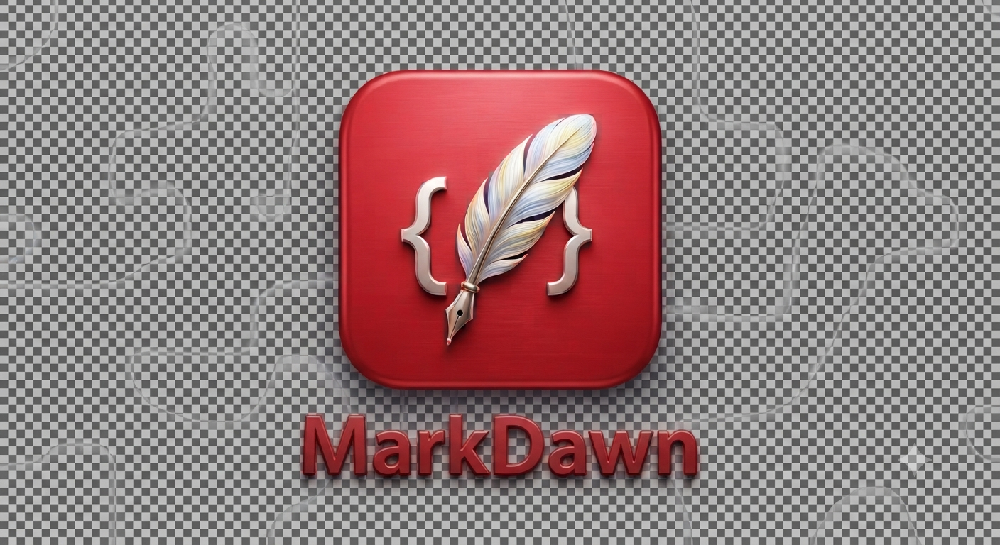

# MarkDawn



A Typora-style seamless Markdown editor with AI built in. Tauri 2 + React + TypeScript,
editor engine [Muya](https://github.com/marktext/muya) (`@muyajs/core` — the engine
extracted from MarkText, the open-source Typora clone).


## Run it

Prereqs: Node 22+, Rust 1.77+, Tauri 2 system deps (`webkit2gtk-4.1` on Linux).

```sh
npm install
npm run tauri dev        # dev app with hot reload
npm run tauri build      # signed-ish release bundle for your OS
```

Optional: [pandoc](https://pandoc.org) on PATH enables Word/LaTeX/RTF/ODT/EPUB export
(auto-detected). [Ollama](https://ollama.com) on `localhost:11434` gives zero-config
local AI. [edge-tts](https://pypi.org/project/edge-tts/) (`pip install edge-tts`)
enables read-aloud.

Linux deb: `npm run deb` builds it and then patches the desktop entry to
`Exec=markdawn %f` (Tauri omits `%f`, which breaks Open With → file) and registers
`text/markdown` + `text/plain` mime types.

## Features

**Editor (Typora parity)**
- Seamless live WYSIWYG Markdown — CommonMark + GFM, inline math (KaTeX), Mermaid,
  Vega-Lite, PlantUML, Prism code blocks, footnotes, front matter, tables
- Tabs with per-tab autosave (500 ms debounce, atomic temp+rename writes), safe close
  (a failed save keeps the tab; cancelled Save-As keeps the tab), flush-on-quit —
  dirty untitled tabs are recovered to the app-data dir if there is nowhere to save them
- File tree workspace, outline/TOC, find & replace (regex / case / whole word),
  workspace-wide text search (⌥⌘F)
- 5 theme modes (Auto light/dark, GitHub, Night, Newsprint, Pixyll), focus mode,
  typewriter mode, window position/size persisted across restarts
- Command palette (⌘K) + quick file open (⌘P) + reopen closed tab (⌘⇧T)
- Images: paste or drag-drop onto the editor (stored in `<doc>_assets/`, referenced
  document-relative — portable Markdown), or insert via picker (picked files are
  referenced in place, not copied into the assets folder)
- Export: HTML (self-contained, themed), PDF (print pipeline), DOCX/ODT/LaTeX/RTF/EPUB
  (pandoc) — every export refuses to overwrite an existing destination
- Drag `.md` files onto the window to open them; `markdawn foo.md` works on first launch

**AI**
- Provider-agnostic: Anthropic, OpenAI, Groq, Ollama (local). Keys live **only in the
  OS keychain** — they never reach the webview or settings.json; all HTTP runs in Rust
- Chat sidebar with multi-turn memory (the last 10 messages ride along), document
  context (head/tail truncation around the selection), document outline, and
  workspace `NOTEPAD.md` injected as writing instructions
- Select text → floating quick actions (improve, grammar, shorter, longer, bullets,
  summarize, translate, custom) → **streaming word-diff popover** → Apply / Discard.
  Apply is refused if the selection changed while the model was running
- Ghost-text autocomplete (Tab to accept) — **off by default**
- Read aloud via edge-tts (Stop actually stops; synth/player children never outlive
  the app)

**Typora-style UI**: native menu bar (File / Edit / Paragraph / Format / View /
Themes / Help), native window chrome, word count pill in the corner, seamless
centered page, source mode (⌘/).

**Shortcuts** (all in the native menu; ⌘ = Ctrl on Linux/Windows): ⌘N new · ⌘O open ·
⇧⌘O open folder · ⌘S save · ⇧⌘S save as · ⌘W close tab · ⌘⇧T reopen tab · ⌘, preferences ·
⌘K palette · ⌘P quick open · ⌘F find · ⌥⌘F workspace search · ⌘/ source mode · ⌘⇧F focus ·
⌥⌘T typewriter · ⌥⌘G ghost text · ⌘⇧L file tree · ⌥⌘O outline · ⌘⇧A AI panel ·
⌘=/⌘-/⌘0 text size · ⌘1–⌘6 headings · ⌘B bold · ⌘I italic · ⌘⇧C inline code ·
⌥⇧5 strikethrough · ⌘\\ clear formatting · ⌘⇧Q quote · ⌘⇧7/8/9 lists ·
⌘⇧K code block · ⌘⇧M math block · ⌥⇧T table

## Architecture

```
src/                     React frontend
├── editor/              Muya wrapper + edit-bridge (single owner of all editor writes)
├── ai/                  streaming client, context builder, prompts, word-diff
├── panels/              file tree, outline, chat, find bar, palette, diff popover,
│                        workspace search
├── commands/            command registry (palette + native menu dispatch through it)
├── stores/              zustand: settings, tabs, workspace, chat, toast
└── themes/              theme CSS (also inlined into HTML export)
src-tauri/               Rust core
└── src/
    ├── fs.rs            confined fs commands, atomic writes, watcher, workspace search,
    │                    image import, recovery saves
    ├── secrets.rs       keychain (set/delete/status only — never readable from JS)
    ├── ai_proxy.rs      streaming SSE/NDJSON proxy: anthropic | openai | groq | ollama
    ├── tts.rs           edge-tts read-aloud (synth + player children, stoppable)
    ├── menu.rs          native menu bar (every item emits one `menu-action` id)
    ├── pick.rs          file pickers (zenity → kdialog, dialog-plugin fallback)
    ├── lifecycle.rs     quit interception (flush handoff), startup file args
    └── export.rs        pandoc
```

Data flow: Muya `json-change` → `getMarkdown()` → debounced atomic save.
AI output returns through the edit-bridge so undo/cursor stay coherent (synthetic
paste event for multi-block Markdown, native `execCommand` for inline text).

## Tests & CI

```sh
npm run typecheck        # tsc --noEmit
npm test                 # vitest: tabs store, chat memory, word-diff, context, prompts,
                         #   settings
cd src-tauri && cargo test   # stream parsers, fs guard, atomic writes, URL allowlist
```

GitHub Actions runs all three on push/PR (`.github/workflows/ci.yml`).

## Known ceilings (deliberate simplifications)

- Inline AI edits use `document.execCommand('insertText')` + synthetic paste events
  (deprecated-but-universal APIs); revisit if WebKit drops them
- Word-diff is O(n·m) LCS — fine for selection-sized texts
- Workspace search is a literal (non-regex) substring scan over `.md/.markdown/.txt`
  files; the in-document find bar has regex if you need it
- Workspace search and fs commands are confined to the opened workspace + paths you
  explicitly pick/drop/launch (`FsGuard`); symlinks that appear after allowance are
  not re-validated
- The `xdg-open` read-aloud fallback hands playback to the desktop default app, so
  Stop can't kill that specific player (install mpv/ffplay for stoppable playback)
- Chat context carries the last 10 messages (~5 exchanges); document bodies in
  document mode are truncated to a 12k-char budget
- Ollama server URLs are restricted to loopback/private hosts (SSRF guard) — a
  publicly-hosted Ollama endpoint won't work
- Updater not wired (needs signing keys + a release server); `tauri-plugin-updater`
  at release time

## Security notes

- API keys: OS keychain only (`keyring` crate), frontend gets a boolean, never the key
- CSP enabled (script-src 'self'; no inline scripts); chat/model output rendered
  through Muya's DOMPurify-sanitized renderer
- All fs commands are confined to user-consented roots (workspace, picked/dropped
  paths, app dirs); `path_join` rejects traversal; images render through data-URL
  transforms (the asset-protocol scope is widened only on consent and is not the
  render path on WebKitGTK)
- Prompt injection: document text, selection, and `NOTEPAD.md` are sent to the model
  verbatim and its output can be applied with one click — treat opened files from
  untrusted sources accordingly (this is inherent to editor-AI integration)
- No secrets in settings.json, no `.env`, nothing hardcoded
